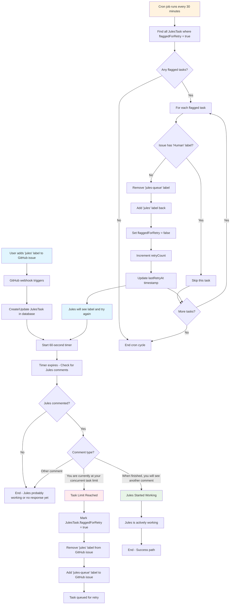

  
  <h1 align="center">Jules Task Queue</h1>
  

    An overengineered, enterprise-grade, open-source task queue for Jules power users.
     
    <a href="https://jules.hildy.io/">Visit Site</a>
    ·
    <a href="https://github.com/ihildy/jules-task-queue/issues/new?assignees=&labels=bug&template=bug_report.md&title=">Report Bug</a>
    ·
    <a href="https://github.com/ihildy/jules-task-queue/issues/new?assignees=&labels=enhancement&template=feature_request.md&title=">Request Feature</a>
  

  

    
    
    
    
  

---

Jules Task Queue is a GitHub-integrated service that solves the "3 concurrent task" bottleneck when using the Google Labs - Jules AI coding assistant. It automatically queues tasks when Jules hits its limit and retries them later, allowing you to seamlessly utilize your full daily quota.

## The Problem: The 3-Task Bottleneck

> "Jules gives you 15 tasks per day but only 3 concurrent slots.\* So you're constantly babysitting the queue, manually re-adding labels every time it hits the limit. There has to be a better way."
> — Every Jules power user, probably

This tool is the better way. It transforms Jules from a tool you have to manage into a true "set it and forget it" automation partner.

## ✨ Features

- **🔑 User Access Token Integration**: Seamlessly integrates with GitHub App user access tokens, ensuring Jules responds to automated label changes.
- **🤖 Task Status Detection**: Automatically detects when Jules is at capacity and intelligently queues new tasks.
- **🔄 Auto-Retry Logic**: 30-minute retry cycles with intelligent label swapping and failure recovery.
- **🚀 Easy Self-Hosting**: Deploy with one click to Vercel, Firebase, or use the provided Docker Compose setup.
- **🔐 GitHub Native**: Secure webhook integration with signature verification and comprehensive audit logging.
- **📊 Enhanced Observability**: Integrated structured logging with Pino for better monitoring and debugging.
- **🔒 Type Safe**: End-to-end TypeScript with tRPC and Zod validation for bulletproof deployments.
- **⚙️ Zero Config (Hosted)**: Install the GitHub App and you're done. No complex setup required.

## 🚀 Getting Started

You can use our hosted version for a zero-config setup or deploy your own instance.

### Hosted Version (Recommended)

1.  **Install the GitHub App**: Click the button below and authorize it for the repositories you want to use.
2.  **Add the `jules` label** to any GitHub issue to start processing.

  

### Self-Hosting

Deploy your own instance with one click:

For detailed instructions on self-hosting with **Docker**, **Vercel**, or **Firebase**, please see our documentation:

- [**SELF_HOSTING.md**](./SELF_HOSTING.md)
- [**GITHUB_APP_SETUP.md**](./GITHUB_APP_SETUP.md)
- [**FIREBASE.md**](./FIREBASE.md)

## 🛠️ How It Works

The system is designed to be a robust, hands-off automation layer on top of your existing GitHub workflow.

## 🤝 Contributing

Contributions, issues, and feature requests are welcome! Feel free to check the [issues page](https://github.com/ihildy/jules-task-queue/issues).

Please read the [**CONTRIBUTING.md**](./CONTRIBUTING.md) for details on our code of conduct and the process for submitting pull requests.

## 📜 License

This project is licensed under the MIT License - see the [LICENSE](./LICENSE) file for details.

## 📢 Disclaimer

Jules Task Queue is an independent productivity tool created by the developer community. We are not affiliated with Jules, Google, or Google Labs in any way. Jules Task Queue simply helps you manage your Jules task queue more efficiently.
